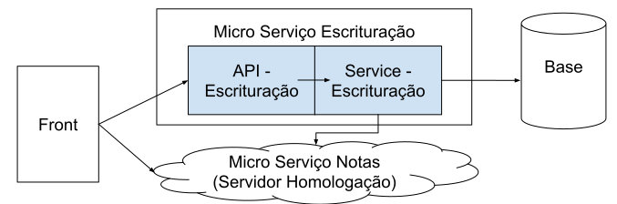

# Do Monolito para Micro Serviços com Simulação

## Objetivos

- Mostrar as vantagens e desvantagens de simular micro serviços
- Mostrar uma forma de simular micro serviços com o [MockServer](http://www.mock-server.com/)

## Contexto 

Será utilizado como exemplo, um sistema monolítico de Contabilidade que possui dois contextos:

- notas
- escrituração

Na parte de notas, basicamente existe um crud para cadastro das notas do cliente. Apresentando uma API e uma Service.

Na parte de escrituração temos um processo de escrituração de notas e listagem dos lançamentos contábeis.

**Processo de escrituração de notas**
> A escrituração é o processo que transforma uma informação em um lançamento contábil. Para cada nota são criados 1 ou mais lançamentos contábeis

## Exercício
A ideia é imaginar que somos do time de escrituração e esse monolito vai ser transformado em micro serviços.

- Como vamos executar o nosso serviço?
- Como vamos testar o nosso serviço?

## Fases

### Monolito

[implementação](monolito)

**Arquitetura do sistema**

- O Front obtém os dados via API
- O Service de escrituração tem acesso direto ao Service de Notas

**Vantagens:**
- fácil de executar.
- fácil de criar testes, especialmente os que envolvem dois contextos diferentes ( _escrituração de notas_ ).

### Micro Serviço ( sem simulador )

[implementação](microservicos_sem_simulacao)

**Arquitetura do sistema**

- Agora o service de escrituração tem que fazer uma chamada http para a API de notas.
- O Front obtém dados de dois micro serviços.
- Cada micro serviço tem sua base de dados.

**Vantagens:**

- As várias relacionadas a utilizar micro serviços.

**Desvantagens**

- Executar um fluxo que envolve mais de um contexto nos faz ter que subir N serviços na máquina ou manter ambientes de teste, isso pode consumir muito recurso de máquina.

- O serviço de notas pode se tornar complexo e passar a ter outros serviços como dependência.

- No Lugar de iniciarmos o serviço de notas localmente, podemos usar um servidor de homologação, mas isso traz problemas, imagine se a equipe de notas faz deploy de uma versão cheia de bugs no servidor de homologação, vai travar o nosso desenvolvimento.

- Se criarmos outro serviço que deve ser escriturado, por exemplo impostos, mais um serviço a ser levantado para testar/executar a escrituração.

### Micro Serviço ( com o simulador )

Durante o desenvolvimento do micro serviço de escrituração, não devemos nos preocupar com a arquitetura do serviços de notas, apenas com os dados que obtemos deste serviço. Logo podemos simular o serviço de notas.

[implementação](microservicos_com_simulacao)

**Arquitetura do sistema**

- Agora o service de escrituração faz uma chamada http para a API de notas ( _sem saber que esta API é mockada_ ).
- O Front obtém dados do micro serviço de escrituração e do mock server de notas

**Vantagens:**

- Menos recurso de máquina utilizado.
- Desenvolvedores da escrituração não precisam conhecer a fundo a arquitetura dos demais serviços.
- Podemos montar os diversos cenários para teste.
- Não precisamos mockar as chamadas HTTP para fazer testes e executar o serviço de escrituração em nossa máquina.

**Desvantagens:**

- Configurar todos os endpoints / resultados para todos serviços dependentes.
- O time tem que ficar mais "Atento" às mudanças da API de Notas, pois vamos ter que replicar as mudanças no servidor mock.

## Fontes

https://medium.com/@copyconstruct/testing-microservices-the-sane-way-9bb31d158c16

http://www.mock-server.com/
